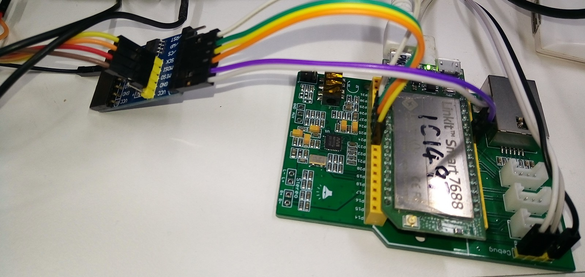
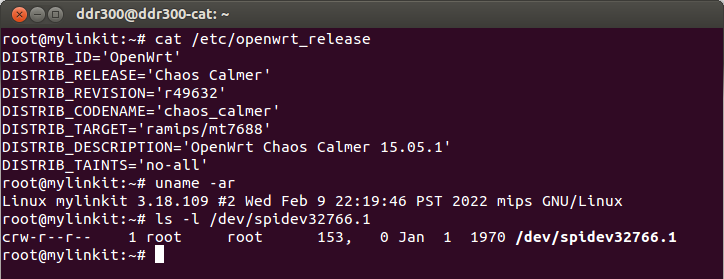
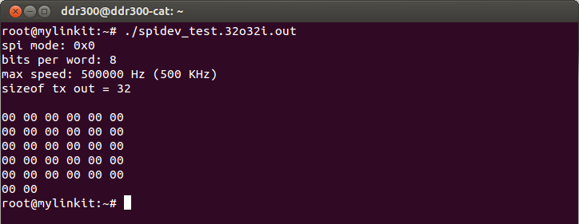
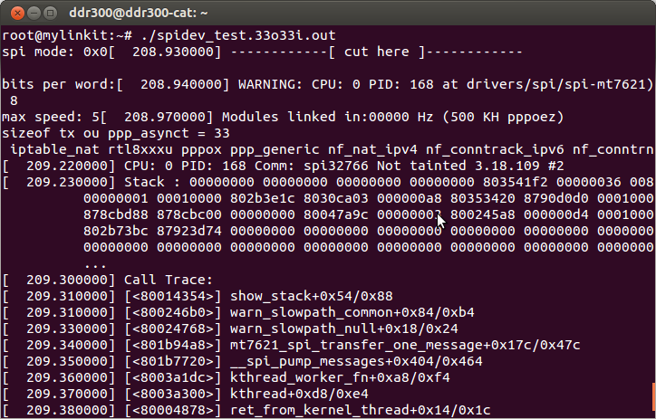
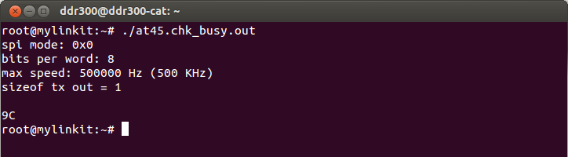
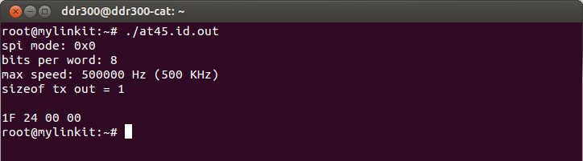
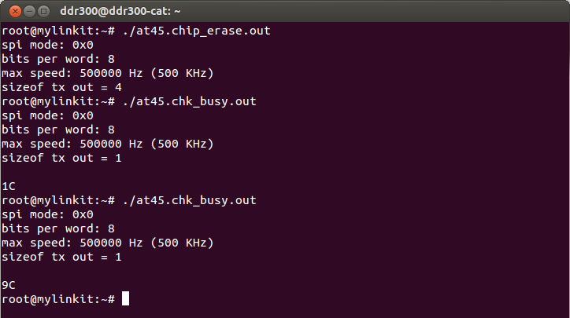
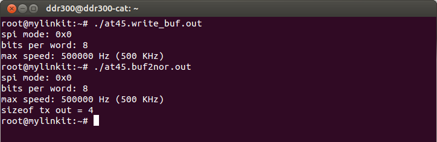
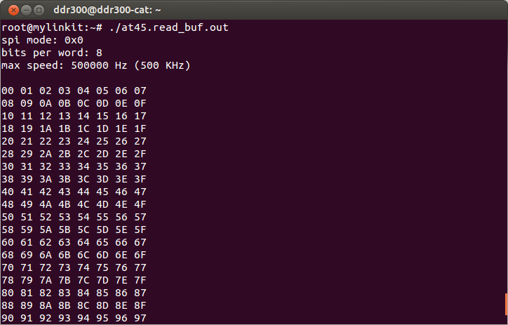

# Linkit7688 / mt7688 SPI interface with NOR flash at45db041d test

Connecting as below picture

Test environment

Test, 32 byte output and 32 byte input, it is OK.+..
Linkit7688 linux 3.18.109 ,There is a SPI node of /dev/spidev32766.1
Read/write this node and access the SPI peripheral.
Half duplex mode, The max r/w is 32 byte input and 32 byte output,
In a word, it takes the time of 64 byte. It is not able to run loopback in the mode.

Test, 33 byte output and 33 byte input, it is NG.

Read AT45 busy flag,
bit#7 = 1 = ready
bit#7 = 0 = busy

Read chip ID = 1F 24 00 00

Erase full NOR chip, it takes some time.
Check busy flag = 0 = busy

Ask AT45 copy date from NOR page#0 to AT45 buffer, and read AT45 buffer to linkit7688.
Because of operation of chip erase, 256 bytes of data are 0xFF.

Write AT45 buffer with 00 – FF, and ask AT45 write date from buffer to AT45 NOR page#0

Power off system and Power on again.
Ask AT45 copy data from NOR page#0 to AT45 buffer,and read data from AT45 buffer to linkit7688,
All of data is kept.

